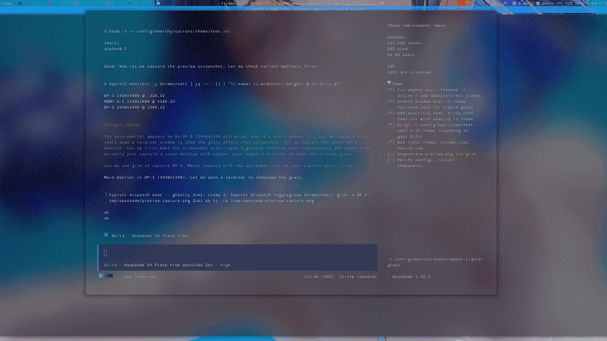
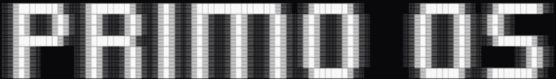
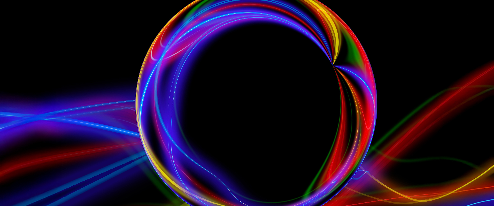
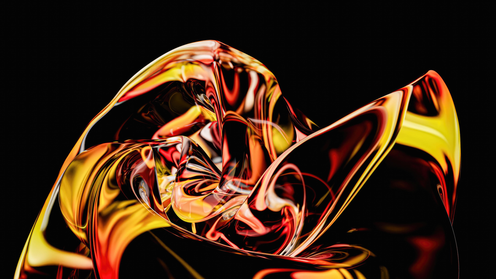

# primoOS Liquid Glass

A translucent, frosted-glass dark theme for [primoOS](https://github.com/PrimoGameStudio) (Omarchy), inspired by macOS Liquid Glass. Blurred, translucent surfaces float over a deep navy base, framed by an animated blue → cyan → violet gradient and soft, glass-like motion.




## What's included

### Hyprland (`hyprland.lua`)
- Frosted glass windows: 10px blur over 3 passes with xray, vibrancy, and 16px rounded corners
- Soft ambient shadows (`range 22`) with a gentle falloff
- Animated gradient active border — blue → cyan → violet at 120°, looping along the border
- Custom glass-style bezier curves (`glassOut`, `glassIn`, `glassEase`, `glassSpring`, `glassBounce`, `glassBack`) driving popin/slide window, layer, and workspace animations
- Opacity rules: translucent windows (0.98 active / 0.5 inactive), with fullscreen content forced fully opaque, unblurred, and undimmed for crisp video and games
- Frosted-glass layer rules for the bar, notifications, launcher, OSD, and polkit surfaces

### Omarchy shell (`shell.toml`)
- Translucent (~0.55 alpha) surfaces with accent-gradient borders for the bar, popups, tooltips, notifications, launcher, menus, polkit, and lock screen
- Shared styling for the image picker and selected/hover/focus control states

### Terminals
A shared 16-color palette across Alacritty (`alacritty.toml`), Foot (`foot.ini`), Ghostty (`ghostty.conf`), and Kitty (`kitty.conf`), all at 0.7 background opacity with a cyan cursor:
- Black `#0a0e1a` / Bright black `#2a3352`
- Red `#ff5f87` / Bright red `#ff7b98`
- Green `#39d98a` / Bright green `#4fe3a0`
- Yellow `#ffd166` / Bright yellow `#ffe08a`
- Blue `#2ea8ff` / Bright blue `#6fbfff`
- Magenta `#b388ff` / Bright magenta `#c49aff`
- Cyan `#4dd0e1` / Bright cyan `#7fe3f0`
- White `#c9d4e8` / Bright white `#f2f6ff`

### Tools
- **btop** (`btop.theme`) — Aqua → Ice → Violet gradients for CPU, memory, network, and temperature graphs
- **Neovim** (`neovim.lua`) — Bluloco Dark colorscheme via LazyVim
- **VS Code** (`vscode.json`) — Bluloco Dark extension

### Extras
- Chromium theme (`chromium.theme`)
- Icon theme pointer (`icons.theme`) — Yaru-blue-dark
- Keyboard backlight RGB (`keyboard.rgb`) — `#2ea8ff`
- Wallpapers in `backgrounds/`

## Palette (`colors.toml`)

| | | |
| --- | --- | --- |
| `#0a0e1a` background | `#070a12` dark | `#05070d` darker |
| `#131a2e` lighter | `#e6edf7` foreground | `#f2f6ff` bright |
| `#2a3352` muted | `#2ea8ff` accent | `#4dd0e1` selection |
| `#ff5f87` red | `#ffd166` yellow | `#39d98a` green |
| `#b388ff` magenta | `#4dd0e1` cyan | `#2ea8ff` blue |

## Installation

```bash
omarchy-theme-install https://github.com/PrimoGameStudio/primoOS-liquid-glass
```

The installer clones the theme into `~/.config/omarchy/themes/` and applies it immediately.

## Wallpapers

| | | |
| --- | --- | --- |
|  |  |  |
|  |  |  |

## Credits

Built by [PrimoGameStudio](https://github.com/PrimoGameStudio) for [primoOS](https://github.com/PrimoGameStudio).

## License

[GPL-2.0](LICENSE)